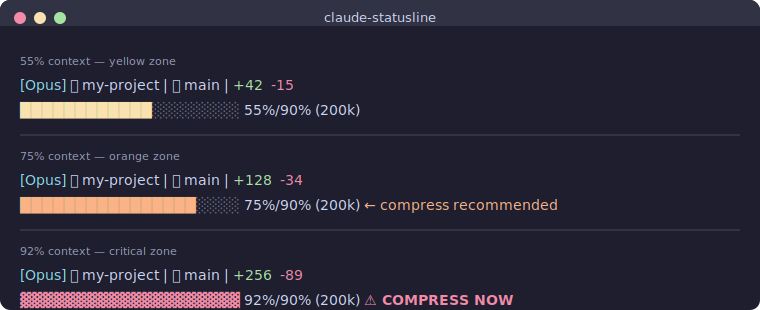

# claude-statusline

A context-aware status line for [Claude Code](https://docs.anthropic.com/en/docs/claude-code) that warns you before your context window fills up.



## Why?

Claude Code auto-compresses context around 90-95%, but by then you've already lost conversation quality. This status line:

- Treats **90% as the effective limit** — the progress bar shows full at 90% real usage
- **Color-codes by urgency** so you know when to `/compact` at a glance
- Shows git branch and lines changed without cluttering the display

## What it looks like

```
[Opus] 📁 my-project | 🌿 main | +42 -15
████████████░░░░░░░░ 55%/90% (200k)
```

### Color thresholds

| Context used | Color | Warning |
|---|---|---|
| 0-49% | 🟢 Green | — |
| 50-69% | 🟡 Yellow | — |
| 70-84% | 🟠 Orange | `← compress recommended` |
| 85-89% | 🔴 **Bold red** | `⚠ compress soon` |
| 90%+ | 🔴 **Bold red ▓▓▓** | `⚠ COMPRESS NOW` |

## Install

```bash
curl -fsSL https://raw.githubusercontent.com/Jaebaek-Lee/claude-statusline/main/install.sh | bash
```

Requires [`jq`](https://jqlang.github.io/jq/). Install with `brew install jq` (macOS) or `apt install jq` (Linux).

## Update

```bash
curl -fsSL https://raw.githubusercontent.com/Jaebaek-Lee/claude-statusline/main/update.sh | bash
```

## Uninstall

```bash
curl -fsSL https://raw.githubusercontent.com/Jaebaek-Lee/claude-statusline/main/uninstall.sh | bash
```

## Manual install

1. Copy `statusline.sh` to `~/.claude/statusline.sh`
2. Make it executable: `chmod +x ~/.claude/statusline.sh`
3. Add to `~/.claude/settings.json`:

```json
{
  "statusLine": {
    "type": "command",
    "command": "~/.claude/statusline.sh"
  }
}
```

## Customization

Edit `~/.claude/statusline.sh` to adjust:

- **`EFFECTIVE_MAX`** (default: 90) — what real % counts as "full"
- **Color thresholds** — change the `PCT -ge` values in the color/warning sections
- **`BAR_WIDTH`** (default: 20) — progress bar character width
- **Bar character** — `█` normally, switches to `▓` at 90%+ for visual distinction

## References

Built on top of Claude Code's [statusline documentation](https://code.claude.com/docs/en/statusline).

## License

MIT
